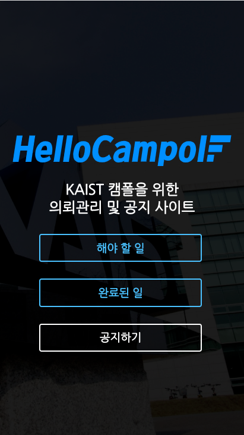
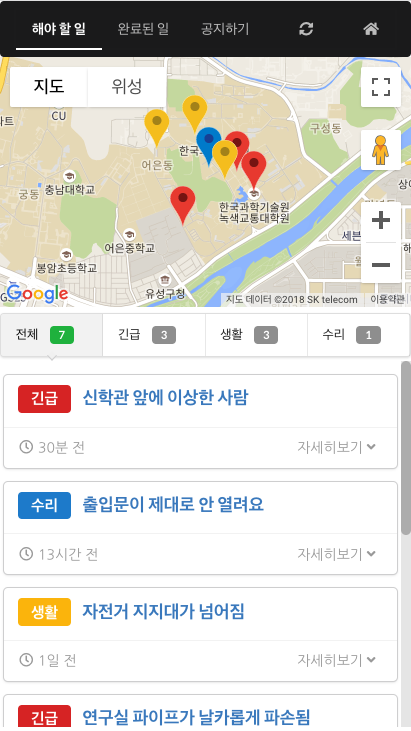
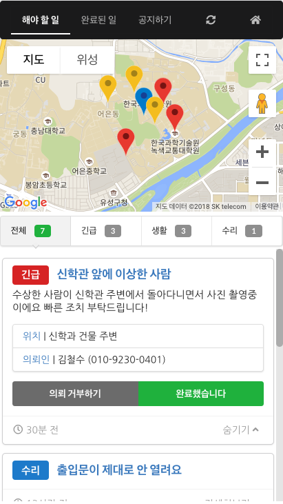
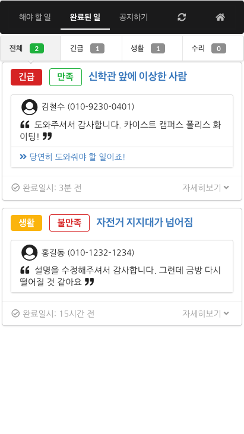
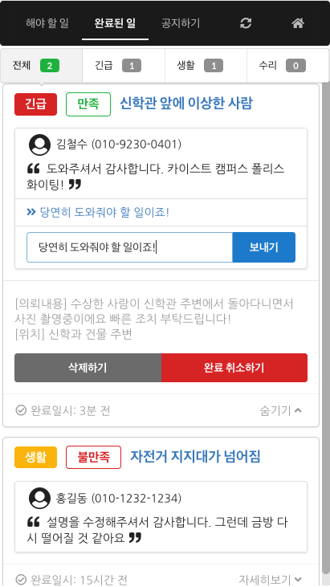
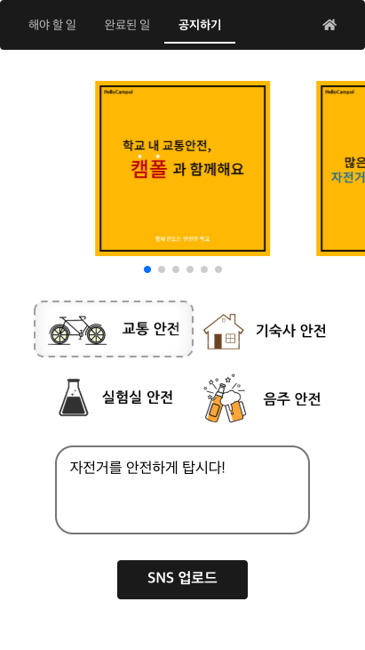
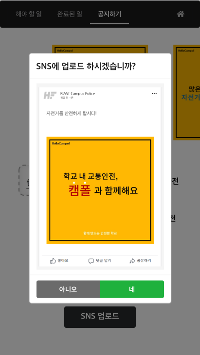

**HelloCampol**
===============

This application is implemented as the part of the project held in CS374 `Introduction to Human-Computer Interaction` in KAIST  
 

 

 
  HelloCampol Introduction Video on Youtube. (Click image to view)    

## Author :
- Bosung Kim (kbs6473@naver.com)
- Donghoon Han (hanuright@gmail.com)
- Jaeyoung Jo (whwodud9@gmail.com)
- Panseok Hwang (kei6040@gmail.com)

## Motivation (What is it for?)
KAIST has in-campus police, so-called **CamPol** (Campus Police), who helps ensure the security and safety of students. However, because of the several intermediate steps to communication between students and them, Campol needs **direct** way of communication to respond to the requests as soon as possible. One of the other important tasks, on the other hand, is raising the safety awareness of students, so we additionally consider the way to spread out safety-related information through SNS conveniently, and **influentially** as well.

## Screenshots  

### Main Page  

 
 

 
  The user can visit desired pages directly through main page.   It has pages for managing incoming requests, completed requests and sns newscard.     

 

### Incoming Requests Management 

 

 
  The user can identify geographical distribution of the incoming requests   with their request types and details. Also the campol can mark an individual request as completed.      

  
 

### Completed Requests Management  

 

 
  The user can identify completed requests with user's feedback and their satisfactory level.   Also the campol can reply to the feedback.  

  
 

### SNS Newscard Management  
 

 

 
  The user can deliver cardnews with the messages to the students easily by uploading preset cardnews to SNS.  

  

## Features  

## Implementation Structure
Each page has a navigation bar, so users can move to every page.

Each css file deals with the layout and style of corresponding page.

1. `index.html` : the first page user encounters
	- `main.css`
	- `main.js` : redirection to the other pages
2. `request.html` : page for managing the request from students. (incl. google map for location info)
	- `request.css`
	- `request.js` : load the request from firebase and show it up as a card. "*Undo*" and "*Completing the task*" are supported. When user opens up the request card, corresponding location is shown as bouncing marker in the map.

3. `completed.html` : page for managing the completed task to report to the school.
	- `completed.css`
	- `completed.js` : load the completed request from firebase and show it up as a card. "*Restore the task as not completed*" and "*Deletion*" are supported.
4. `cardnews.html` : page for convenient uplaod of cardnews to the SNS.
	- `cardnews#.html` : page for checking out the cardnews slides. We now provides four freuqently-noticed topics chosen from the interview; Traffic safety, Dormitory safety, Drinking safety, and Experiment safety. Users can upload notice to SNS here.
	- `cardnews.css`
	- `cardnews.js` : *Swipeslider* gives the affordance for users to slide the cardnews pages. **SNS upload is not yet supported.**  

